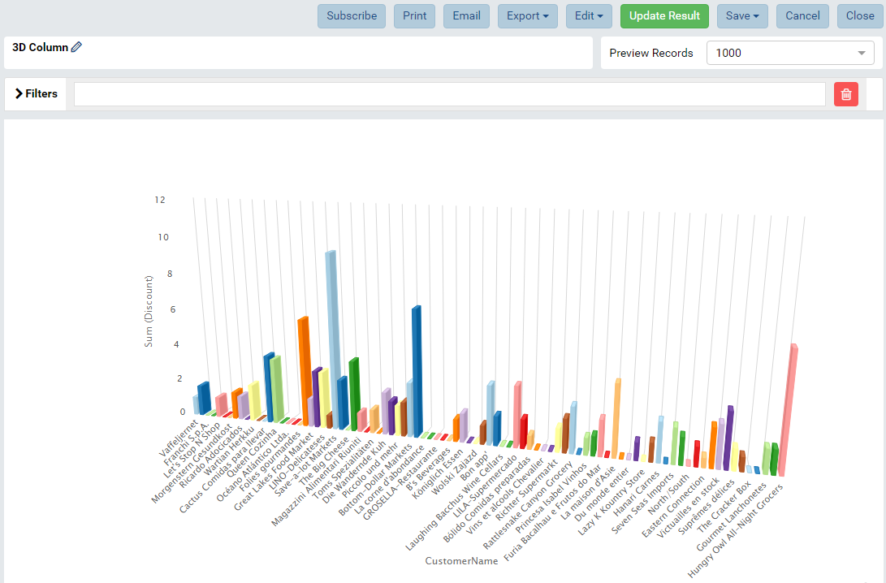
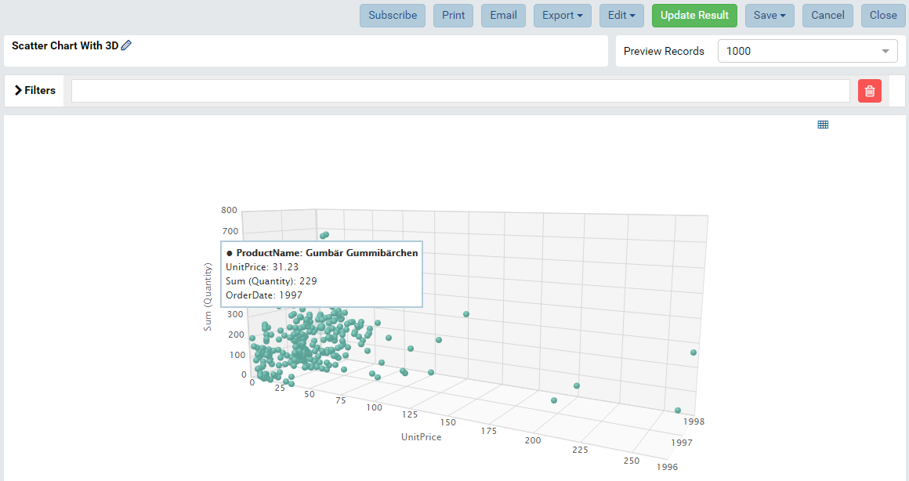

# Izenda Custom Visualizations

The examples of how to customize or extend the Izenda visualizations using JS APIs.

- 3D Column chart (/src/3d_column) demonstrates the ability of extending a column chart by adding a "Enable 3D" checkbox option into property panel of report designer.
  
- 3D Scatter chart (/src/3d_scatter) demonstrates the ability of extending a scatter chart by adding an additional fields container (Z-Axis Values) and rendering the scatter plots in 3 dimensions chart.
  

**Note that this example is using for demonstration of the flexibility of Izenda JS API to adopt the various requirements on building a custom chart.**

### Installation

- Change the WebAPIUrl value to Izenda Standalone BE API in /src/config.js
- Run following npm command

```
npm install
```

### Start Dev Server

```
npm run dev
```

### Build Prod Version

```
npm run build
```

### Features:

- ES6 Support via [babel-loader](https://github.com/babel/babel-loader)
- SASS Support via [sass-loader](https://github.com/jtangelder/sass-loader)
- Linting via [eslint-loader](https://github.com/MoOx/eslint-loader)

When you run `npm run build` we use the [extract-text-webpack-plugin](https://github.com/webpack/extract-text-webpack-plugin) to move the css to a separate file and included in the head of your `index.html`, so that the styles are applied before any javascript gets loaded. We disabled this function for the dev version, because the loader doesn't support hot module replacement.

### Credit:

The codebase was initiated from https://github.com/wbkd/webpack-starter
